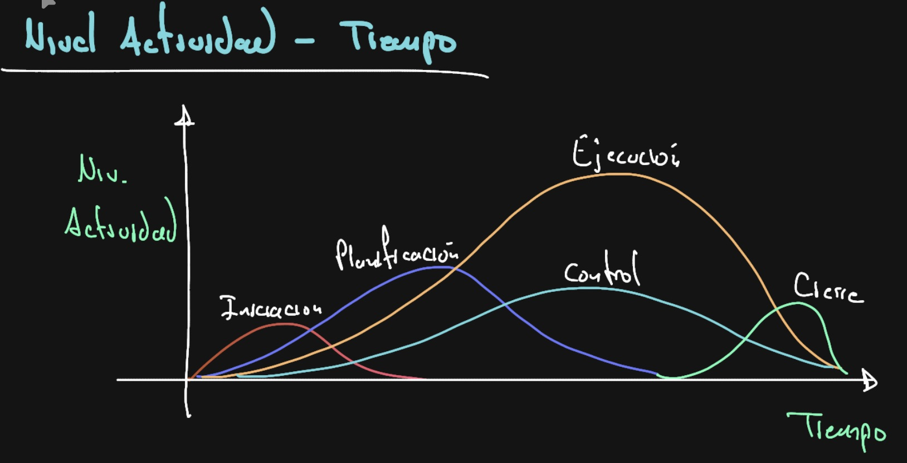

## Tema 1: Introducción a la Dirección y la Gestión de Proyectos Software.

### 1. ¿Qué es (y qué no es) un Proyecto?


* **Definición:** Un proyecto es un **esfuerzo temporal** emprendido para crear un producto o servicio **único**.

* **Características principales:**
    * Objetivos claros y tareas identificables.


    * Requiere especialistas y planificación detallada.


    * **Recursos limitados:** Dinero, personas y tiempo.

* **Tipos de Organización del Trabajo:**
    * **Producción en masa**: Ensamblar productos ó servicios especializados buscando economias de escala.
    * **Producción por lotes**: Sistemas flexibles para productos similares donde la producción se adapta.
    * **Proyectos**: Productos o resultados que se realizan una sola vez con tareas especificas que probablemente no se repitan.

### 2. Desarrollo de un Proyecto

* **Ciclo de Vida:**
    * **Procesos Productivos**:
    ```mermaid
    timeline
        title Procesos Productivos
        1 : Conceptualización
        2 : Requisitos
        3 : Planificación
        4 : Diseño
        5 : Construcción
        6 : Entrega
        7 : Cierre

*  **Metodologías (de Desarrollo):** Son los marcos de trabajo (como SCRUM o CRISP-DM) que nos dan las herramientas y procesos para gestionar el trabajo.

* **Gestión de Proyectos:** 
    * **Procesos de Gestión:** 
    ```mermaid
    gantt
    title Diagrama Gantt con Seguimiento y Control superpuesto
    dateFormat  YYYY-MM-DD
    axisFormat  %d-%m

    section Iniciación
    Inicio del proyecto               :a1, 2025-01-01, 5d

    section Planificación
    Definición de alcance             :a2, 2025-01-05, 4d
    Identificación de actividades     :a3, 2025-01-07, 1d
    Estimación de recursos            :a4, after a3, 1d
    Desarrollo del cronograma         :a5, after a4, 4d
    Ajuste de cronograma              :a11, 2025-01-15, 3d
    Revisión de riesgos               :a12, 2025-01-17, 4d

    section Ejecución
    Ejecución de tareas               :a6, 2025-01-13, 10d

    section Seguimiento y Control
    Monitoreo de avance               :a7, 2025-01-14, 14d
    Control de calidad                :a8, 2025-01-18, 10d

    section Cierre
    Validación final                  :a9, 2025-01-26, 3d
    Documentación y entrega           :a10, after a9, 2d
    Revisión de entregables           :a13, 2025-01-25, 3d
    Firma de aceptación               :a14, 2025-01-29, 2d


### 3. Gestion de Proyectos

Forma de organizar el trabajo para alcanzar ese objetivo **único** y **temporal**.

* **Funciones**:
    * **Planificar**: Definir los resultados buscados y cómo conseguirlos.
    * **Organizar**: Asignar las tareas planificadas a las personas y equipos.
    * **Controlar**: Comprobar si se están logrando los resultados y corregir desviaciones.
    * **Dirigir**: Liderar y motivar al equipo para alcanzar los objetivos.


* **La Triple Restricción:** La calidad del producto final depende del equilibrio entre tres factores :

    * **Alcance**: si aumenta el Alcance, entonces aumenta el Coste o el Tiempo.
    * **Tiempo**: si reduces el Tiempo, entonces aumentas el Coste o reduces el Alcance.
    * **Coste**: si reduces el Coste, entonces reduces el Alcance o aumentas el Tiempo.

* **Procesos de Gestión de Proyectos:**
    * Workflow de información entre proyectos:
        ```mermaid
        flowchart TD
            A(P. Iniciación) --> B(P. Planificación)
            B --> C(P.Ejecución)
            C --> D(P.Control)
            D --> B(P.Planificación)
            D --> E(P.Cierre)

**Curva de Nivel de Actividad - Tiempo:**




**Áreas de Conocimiento:** Son las "piezas" que el gestor debe malabarear:

- **Integración:** Coordinar todos los elementos del proyecto.
- **Alcance:** Asegurar que se cumplen los objetivos.
- **Tiempo:** Controlar los plazos acordados.
- **Coste:** Controlar que el proyecto se mantenga dentro del presupuesto.
- **Calidad:** Verificar que el producto/servicio satisfaga las necesidades del cliente.
- **RRHH:** Gestionar eficazmente a las personas involucradas.
- **Comunicación:** Asegura que la información se genera, distribuye y almacena correctamente.
- **Riesgos:** Identificar, analizar y responder a los posibles problemas.
- **Adquisiciones:** Comprar bienes y servicios a terceros.
- **Interesados:** Gestionar la participación y espectativas de todas las personas o grupos afectados por el proyecto.

**Matriz Procesos de Negocio - Áreas de Conocimiento:** 


### 4. Habilidades & Rol del Director de Proyecto y Factores de Éxito

* **Fracaso:** Planificación inadecuada, falta de apoyo de la dirección o requisitos poco claros.


* **Éxito:** Procesos sólidos, objetivos alineados con la estrategia, y buen manejo de cambios.


* **Habilidades del Director de Proyecto:**
    * **Hard Skills (Técnicas):** Presupuestos, planificación, riesgos .


    * **Soft Skills (Interpersonales):** Liderazgo, negociación, comunicación .

* **Roles Clave de Director de Proyecto:**
    - Defenir el alcance
    - Liderar el equipo
    - Identificar a los intersados
    - Desarrollar el plan de proyecto
    - Gestionar riesgos y el cambio
    - Manejar la triple restricción
    - Comunicar el progreso

*Nota de experto:* A menudo se dice que un gestor de proyectos pasa el 90% de su tiempo comunicando. Las habilidades blandas son vitales.


### 5. Origen y Viabilidad (Página 6)

**Surgen** como respuesta a necesidades u objetivos estrategicos de una organizacion:
- Productos obsoletos
- Necesidad de competitividad
- Ideas de empleados
- Oportunidades de negocio
- Vision estratégica
- Intereses publicos/privados

**Analisis de Viabilidad**
- Costes (económicos, recursos, riesgos)
- Beneficios (ingresos, imagn de marca, posicionamiento)

### 6. Contratación Pública (Página 7)

Este apartado es específico para proyectos con la administración.

**Tipos de Contrato más comunes:** 
* Suministros (bienes): 
    - Adquisicion de equipos
    - Sitemas informáticos
    - Software estandar
* Servicios (actividades):
    - Desarrollo de actividades
    - Obtención de resultados distintos de una obra o suministro
    - Software hecho a medida

**Procedimientos de Adjudicación:**
* **Procedimientos Menores:**
    - Hasta 40 000 euros para **obras**
    - Hasta 15 000 euros para **otros**
    - No pueden durar más de un año o prorrogarse.

* **Procedimientos Negociados:** 
    - La administración negocia con candidatos específicos.
    - Pueden ser con o sin publicidad.


* **Concurso Público:** 
    - Abierto (cualquiera se presenta)
    - Restringido (solo invitados)
    - No tienen limites de cuantia o plazo.


### 7. Procesos de Gestión vs. Procesos de Negocio (Página 8)

Finalmente, una distinción importante para no perder el norte.

* 
**Procesos de Gestión:** Son internos, buscan eficiencia y administrar la organización (ej. RRHH, Finanzas).


* 
**Procesos de Negocio:** Son externos, buscan generar valor directo al cliente (ej. Ventas, Producción).


---

**Para reflexionar juntos:**
Basándonos en la "Triple Restricción" de la página 3 (Bueno, Bonito, Barato), imagina que tu jefe te pide reducir el tiempo de entrega de un proyecto a la mitad sin aumentar el presupuesto. Según este modelo, **¿qué elemento del triángulo se vería inevitablemente afectado?**