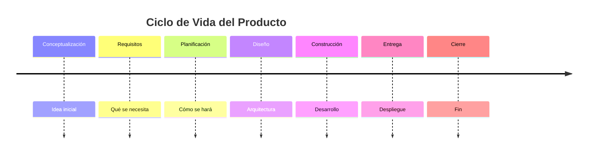
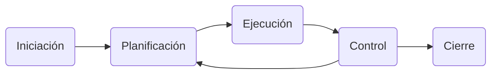

# Tema 1: Introducción a la Dirección y la Gestión de Proyectos Software

Este tema establece los cimientos conceptuales de la Dirección de Proyectos, delimitando la naturaleza única y temporal de los **proyectos frente a las operaciones continuas y la producción en masa.** Se profundiza en la dicotomía entre el **Ciclo de Vida del Producto (desarrollo técnico)** y el **Ciclo de Vida del Proyecto (gestión)**, definiendo el **rol crítico del Director de Proyecto** y las competencias necesarias **para equilibrar la Triple Restricción (Alcance, Tiempo y Coste)**. Finalmente, se contextualiza el nacimiento de los proyectos desde la estrategia organizacional **(Business Case)** y se examinan los marcos normativos esenciales de la **Contratación Pública (Suministros vs. Servicios)** que rigen la ejecución en entornos administrativos.

## 1. Concepto de proyecto
**Definición:** Un proyecto es un esfuerzo temporal que se lleva a cabo para crear un producto, servicio o resultado único.

### 1.1. Características Principales
*   **Temporalidad:** Tiene un inicio y un final definidos. No es un esfuerzo continuo.
*   **Unicidad:** El entregable final es diferente a otros anteriores.
*   **Recursos Limitados:** Opera bajo restricciones de dinero, personas y tiempo.
*   **Claridad:** Requiere objetivos claros, tareas identificables y planificación detallada.

### 1.2. Organización del Trabajo
No todo trabajo es un proyecto. Existen diferentes tipologías productivas:
*   **Producción en masa:** Ensamblaje de productos buscando economías de escala (ej. coches).
*   **Producción por lotes:** Sistemas flexibles para productos similares.
*   **Proyectos:** Productos o resultados únicos ("One-off") con tareas específicas que probablemente no se repitan.

**Distinción Clave:** Mientras que los **Procesos de Gestión** (RRHH, Finanzas) son internos y repetitivos para administrar la organización, y los **Procesos de Negocio** (Ventas, Producción) son continuos para generar valor, el **Proyecto** es finito y transformador.

## 2. Desarrollo de un proyecto
El desarrollo se refiere al ciclo de vida técnico del producto (el "qué" se está construyendo), que debe distinguirse de la gestión del proyecto (el "cómo" se administra).

### 2.1. Ciclo de Vida del Producto
Fases típicas por las que pasa la construcción del software o producto:

### 2.2. Metodologías de Desarrollo
Son los marcos de trabajo que proporcionan herramientas y procesos específicos para ejecutar el desarrollo (ej. SCRUM, CRISP-DM).

## 3. La gestión de los proyectos
Es la aplicación de conocimientos, habilidades y técnicas para organizar el trabajo y alcanzar el objetivo único y temporal.

### 3.1. Funciones de la Gestión
*   **Planificar:** Definir resultados y la ruta para conseguirlos.
*   **Organizar:** Asignar tareas a recursos y equipos.
*   **Dirigir:** Liderar y motivar.
*   **Controlar:** Medir resultados y corregir desviaciones.

### 3.2. La Triple Restricción
El equilibrio de la calidad del proyecto depende de tres factores interconectados. Si uno cambia, afecta a los otros:
*   **Alcance:** Todo el trabajo necesario.
*   **Tiempo:** El calendario del proyecto.
*   **Coste:** El presupuesto disponible.

> **Regla:** Si reduces el Coste, inevitablemente reduces el Alcance o aumentas el Tiempo.

### 3.3. Procesos de Gestión (El Ciclo de Vida del Proyecto)
Independientemente de lo que se construya, la gestión sigue este flujo:

La fase de Control es iterativa y retroalimenta la Planificación y la Ejecución constantemente.

### 3.4. Áreas de Conocimiento
Son las "piezas" que el gestor debe coordinar simultáneamente:
*   **Integración:** Coordinación global.
*   **Alcance, Tiempo, Coste:** La Triple Restricción.
*   **Calidad:** Satisfacción de necesidades.
*   **RRHH:** Gestión de personas.
*   **Comunicaciones:** Flujo de información.
*   **Riesgos:** Incertidumbre.
*   **Adquisiciones:** Compras externas.
*   **Interesados:** Stakeholders.

### 3.5. Mapa de Procesos (Matriz de Conocimiento)
La interacción entre los Grupos de Procesos y las Áreas de Conocimiento define qué se hace en cada momento. Algunos cruces clave son:

| Área / Grupo | Iniciación | Planificación | Ejecución | Control | Cierre |
| :--- | :--- | :--- | :--- | :--- | :--- |
| **Integración** | Desarrollar Acta de Constitución | Desarrollar Plan de Proyecto | Dirigir el Trabajo | Monitorear y Controlar Cambios | Cerrar Proyecto |
| **Alcance** | - | Recopilar Requisitos, EDT | - | Validar y Controlar Alcance | - |
| **Tiempo** | - | Definir Actividades, Cronograma | - | Controlar Cronograma | - |
| **Coste** | - | Estimar Costos, Presupuesto | - | Controlar Costos (EVM) | - |
| **Calidad** | - | Planificar Calidad | Aseguramiento (QA) | Control Calidad (QC) | - |
| **R.R.H.H** | - | Planificar RRHH | Adquirir, Desarrollar y Dirigir Equipo | - | - |
| **Comunicaciones** | - | Planificar Comunicaciones | Gestionar Comunicaciones | Controlar Comunicaciones | - |
| **Riesgos** | - | Identificar, Analizar y Planificar Respuesta | - | Controlar Riesgos | - |
| **Adquisiciones** | - | Planificar Adquisiciones | Efectuar Adquisiciones | Controlar Adquisiciones | Cerrar Adquisiciones |
| **Interesados** | Identificar Interesados | Planificar Gestión | Gestionar Participación | Controlar Participación | - |

### 3.6. Distribución del Esfuerzo (Curvas de Actividad)
El esfuerzo no es lineal durante la vida del proyecto:
*   **Fase de Planificación:** Consume recursos moderados pero crecientes.
*   **Fase de Ejecución:** Es el pico máximo de consumo de recursos y costes.
*   **Fase de Monitoreo:** Es constante y paralela a todas las fases.
*   **Fase de Cierre:** Muestra un esfuerzo final específico para la entrega y lecciones aprendidas.

## 4. Éxito y Fracaso en proyectos
El resultado no es accidental; depende de factores específicos de gestión y entorno.
*   **Causas de Fracaso:** Planificación inadecuada, requisitos poco claros, o falta de apoyo de la dirección.
*   **Factores de Éxito:** Procesos sólidos, objetivos alineados con la estrategia empresarial y una gestión del cambio eficiente.

## 5. Habilidades, Roles y Responsabilidades del Director de proyecto
El Director de Proyecto (PM) es el responsable final del éxito del esfuerzo.

### 5.1. Roles Clave
Sus responsabilidades incluyen definir el alcance, liderar al equipo, identificar a los interesados, desarrollar el plan, gestionar riesgos, manejar la triple restricción y comunicar el progreso.

### 5.2. Habilidades Necesarias
*   **Hard Skills (Técnicas):** Capacidad para hacer presupuestos, planificar cronogramas y gestionar riesgos.
*   **Soft Skills (Interpersonales):** Liderazgo, negociación, resolución de conflictos y comunicación.

> *Nota de experto:* Un gestor de proyectos pasa el 90% de su tiempo comunicando. Las habilidades blandas son vitales.

## 6. ¿Cómo surgen los proyectos?
Los proyectos nacen como respuesta a necesidades u objetivos estratégicos de la organización.

### 6.1. Orígenes Comunes
*   Obsolescencia de productos actuales.
*   Necesidad de competitividad en el mercado.
*   Ideas internas de empleados o visión estratégica.
*   Oportunidades de negocio o requisitos legales.

### 6.2. Análisis de Viabilidad
Antes de aprobarse, se debe valorar:
*   **Costes:** Económicos, recursos necesarios y riesgos asociados.
*   **Beneficios:** Ingresos potenciales, imagen de marca y posicionamiento.

## 7. Contratación del Sector Público
Cuando el cliente es la Administración Pública, la gestión de adquisiciones sigue reglas estrictas.

### 7.1. Tipos de Contrato
*   **Suministros:** Adquisición de bienes tangibles, equipos o software estándar.
*   **Servicios:** Desarrollo de actividades, obtención de resultados intangibles o desarrollo de software a medida.

### 7.2. Procedimientos de Adjudicación
*   **Procedimientos Menores (Asignación directa):**
    *   *Límite Obras:* Hasta 40.000 euros.
    *   *Límite Otros (Servicios/Suministros):* Hasta 15.000 euros.
    *   *Condición:* Duración máxima de un año, sin prórroga.

*   **Procedimientos Negociados:** La administración consulta y negocia con candidatos específicos (con o sin publicidad).

*   **Concurso Público:**
    *   Sin límites de cuantía.
    *   Puede ser **Abierto** (cualquiera se presenta) o **Restringido** (solo invitados).

## 8. Procesos de Gestión vs. Procesos de Negocio
Finalmente, una distinción importante para no perder el norte.

*   **Procesos de Gestión:** Son internos, buscan eficiencia y administrar la organización (ej. RRHH, Finanzas).
*   **Procesos de Negocio:** Son externos, buscan generar valor directo al cliente (ej. Ventas, Producción).

---

### 9. Guía Visual para Infografías

Este tema cuenta con un conjunto de herramientas interactivas diseñadas para visualizar conceptos abstractos de gestión. A continuación, se detalla su utilidad pedagógica para afianzar los fundamentos teóricos:

#### 1. Concepto y Diferenciación (Slide 1)
*   **Utilidad:** Ayuda a interiorizar la definición de proyecto mediante el contraste directo.
*   **Funcionamiento:** Presenta tarjetas comparativas que enfrentan las características de un "Proyecto" (único, temporal) contra las "Operaciones" (continuas, repetitivas), reforzando visualmente la naturaleza transformadora y finita de los proyectos.

#### 2. La Triple Restricción (Slide 3 - Pestaña "Triple R.")
*   **Utilidad:** Comprender intuitivamente el concepto de "Trade-off" o compromiso forzoso.
*   **Funcionamiento:** Un triángulo interactivo permite seleccionar cada vértice (Alcance, Tiempo, Coste). Al activar uno, el sistema explica cómo su alteración fuerza mecánicamente a reajustar los otros dos para mantener el equilibrio de la calidad, simulando la toma de decisiones real del director.

#### 3. El Flujo de Procesos (Slide 3 - Pestaña "Workflow")
*   **Utilidad:** Visualizar la no-linealidad de la gestión de proyectos.
*   **Funcionamiento:** Un diagrama de flujo interactivo que ilumina las rutas entre los grupos de procesos. Destaca visualmente cómo el **Control** no es una fase final aislada, sino un proceso cíclico que retroalimenta constantemente a la Planificación y la Ejecución durante toda la vida del proyecto.

#### 4. Curvas de Actividad (Slide 3 - Pestaña "Curvas")
*   **Utilidad:** Entender la distribución real del esfuerzo y el presupuesto en el tiempo.
*   **Detalle:** Muestra gráficas superpuestas donde se aprecia que, aunque la **Planificación** es intensa al inicio, la **Ejecución** consume la inmensa mayoría de los recursos, y el **Cierre** requiere un esfuerzo final específico que a menudo se subestima erróneamente.

#### 5. Matriz de Conocimiento (Slide 3 - Pestaña "Matriz")
*   **Utilidad:** Mapa mental completo de la gestión profesional (basado en PMBOK).
*   **Funcionamiento:** Una rejilla interactiva cruza las **10 Áreas de Conocimiento** (filas) con los **5 Grupos de Procesos** (columnas). Al hacer clic en las intersecciones activas, se revela qué procesos específicos ocurren en ese momento (por ejemplo, qué implica exactamente la "Gestión de Costes" durante la fase de "Planificación").

#### 6. Contratación Pública (Slide 6)
*   **Utilidad:** Simplificar y esquematizar la burocracia administrativa del sector público.
*   **Funcionamiento:** Utiliza esquemas visuales para clasificar rápidamente los tipos de contratos (diferencia entre Servicios y Suministros) y visualiza los umbrales económicos (15k€ / 40k€) que determinan si una adjudicación puede ser directa (Contrato Menor) o requiere procedimientos más complejos.
